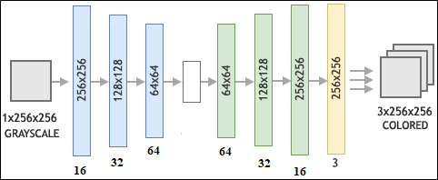
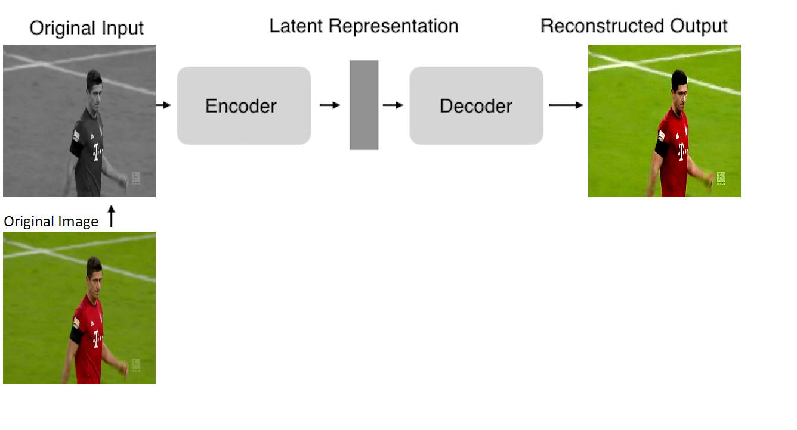

# Auto-Colourisation-Model
Research Project
An autoencoder is an unsupervised learning model that leverages the power of neural networks for the task of representation learning. Representation learning is a technique that enables a system to automatically extract essential information from the raw data to facilitate a representation required for feature detection or categorisation. An autoencoder is categorised as unsupervised owing to the use of the input data as ground truth, in contrast to a supervised model that explicitly provides labelled data for validation. The lack of labelled data allows a model to discover patterns and structures in the data to achieve the desired representation of the input data. In representation learning, a model compresses the input data into a lower dimensional representation referred to as a latent space. This forces the model to learn the representation features of the input as the lower dimension lacks the desired dimension to fully represent the input data. The learned features are subsequently used to reconstruct the original input data from the lower dimensional representation. 

An autoencoder structure comprises two layers connected through a latent space; in the first layer referred to as an encoder, data is compressed to a latent space by learning the features and ignoring trivial information; while in the second layer, the decoder reconstructs the original input from the lower dimensional representation.  The described layers are illustrated in Figure 1, where the blocks shaded in blue represent the encoder and the blocks shaded in green represent the decoder; the latent space is the connecting layer represented by the white block between the blue and green blocks.



================
Colorizing: 
----------------------
1) Run the training script to generate a model
```
./training.py 
```
2) Run the testing script to test the model performance
```
./testing.py
```
3) Full project on Google drive link below.
```
https://drive.google.com/drive/folders/10fIwJ6eMmm2mX6tdUKEl-fLcFq7h6NpS?usp=sharing
```

Project Output:
------------------------------------


